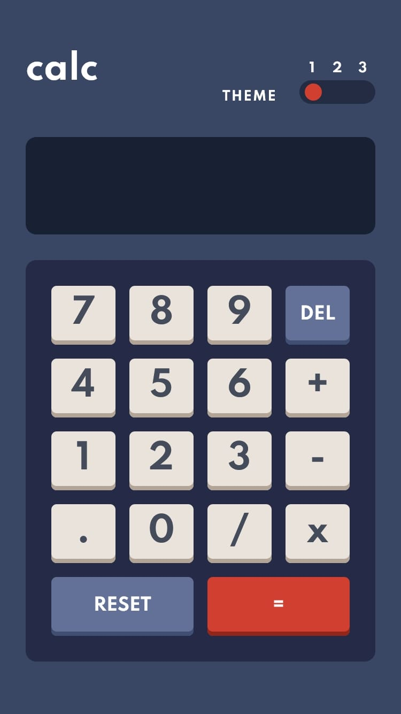

# Frontend Mentor - Calculator app solution

This is a solution to the [Calculator app challenge on Frontend Mentor](https://www.frontendmentor.io/challenges/calculator-app-9lteq5N29). Frontend Mentor challenges help you improve your coding skills by building realistic projects. 

## Table of contents

- [Overview](#overview)
  - [The challenge](#the-challenge)
  - [Screenshot](#screenshot)
  - [Links](#links)
- [My process](#my-process)
  - [Built with](#built-with)
  - [What I learned](#what-i-learned)
  - [Continued development](#continued-development)
  - [Useful resources](#useful-resources)
- [Author](#author)
- [Acknowledgments](#acknowledgments)

**Note: Delete this note and update the table of contents based on what sections you keep.**

## Overview

### The challenge

Users should be able to:

- See the size of the elements adjust based on their device's screen size
- Perform mathmatical operations like addition, subtraction, multiplication, and division
- Adjust the color theme based on their preference
- Use localstorage to save the choosen theme

### Screenshot



### Links

- Solution URL: [Add solution URL here](https://www.frontendmentor.io/solutions/calculator-multitheme-PIC063pAa)
- Live Site URL: [Add live site URL here](https://godm0de.github.io/Calculator-app/)

## My process

### Built with

- Semantic HTML5 markup
- CSS custom properties
- Flexbox
- CSS Grid
- Mobile-first workflow
- BEMIT & SASS

### What I learned

I learn to manager serveral color themes with sass, i could implemented a prefer-color-scheme media query but i decied to use localstorage to save the choosen theme.

I guess the magic lives in the sass theme file and this mixin:

```scss
:root{
    @include mixin.to-css-variables(colors.$dark-theme-color);
    
    &.dark-theme{
        @include mixin.to-css-variables(colors.$dark-theme-color);
    }

    &.light-theme {
        @include mixin.to-css-variables(colors.$light-theme-color);
    }
    
    &.violet-theme {
        @include mixin.to-css-variables(colors.$violet-theme-color);
    }
}
```
```scss
@mixin to-css-variables($map) {
    @each $key, $value in $map {
        --#{$key}: #{$value};
    }
}
```

I decided to use themes in another section between the generic and elements ITCSS architecture, then the last thing you need is a setting and replay this
one for any color theme that you got and then... it's ready to go!

```scss
$dark-theme-color: (
    "main-bg-color": nth($_very-dark-desaturated-blue, 1),
    "main-text-color": $_white,
    "toggle-bg-color": nth($_very-dark-desaturated-blue, 2),
    "toggle-color": $_red,
    "toggle-text-color": $_white,
    "screen-bg-color": nth($_very-dark-desaturated-blue, 3),
    "screen-text-color": $_white,
    "keypad-bg-color": nth($_desaturated-dark-blue, 3),
    "common-key-bg-color": $_light-grayish-orange,
    "common-key-shadow-color": $_grayish-orange,
    "common-key-text-color": $_very-dark-grayish-blue,
    "menu-key-bg-color": nth($_desaturated-dark-blue, 1),
    "menu-key-shadow-color": nth($_desaturated-dark-blue, 2),
    "menu-key-text-color": $_white,
    "equal-key-bg-color": $_red,
    "equal-key-shadow-color": $_dark-red,
    "equal-key-text-color": $_white,
);
```
Now the complete color scheme is fully customizable...

### Continued development

I'll keep working in multithemes because one of the things that i really wish is to made a really scalable, manageable and customizable multitheme site. Something that doesn't as easier
as it is.

## Author

- Frontend Mentor - [@Godm0de](https://www.frontendmentor.io/profile/Godm0de)
- Github - [@Godm0de](https://github.com/)

## Acknowledgments

I guess this challenge is pretty cool to practice grid and multitheme logic. I really enjoyed it, thanks frontedmentor!
